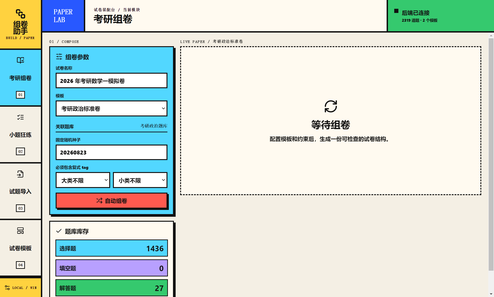
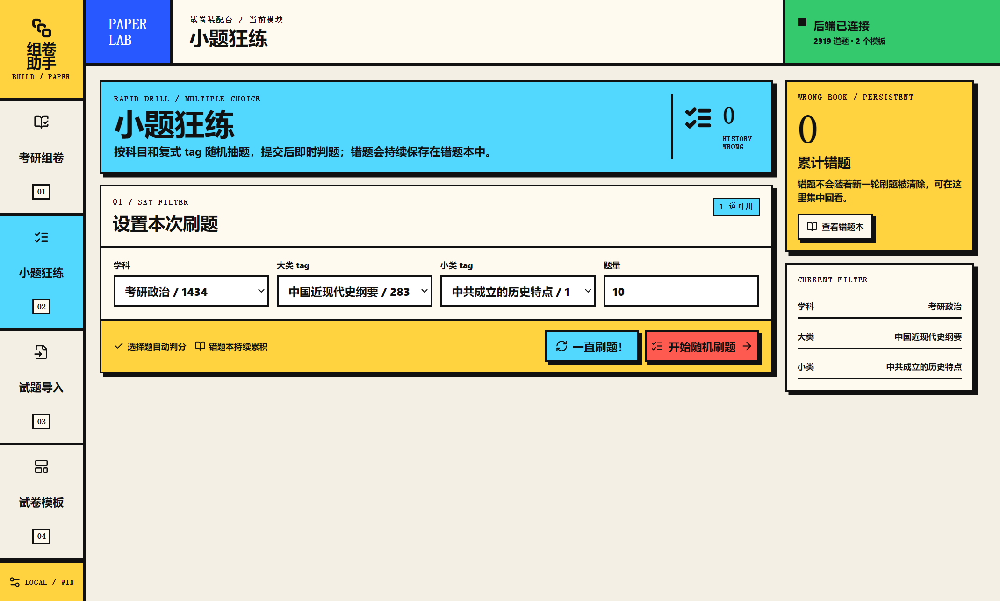
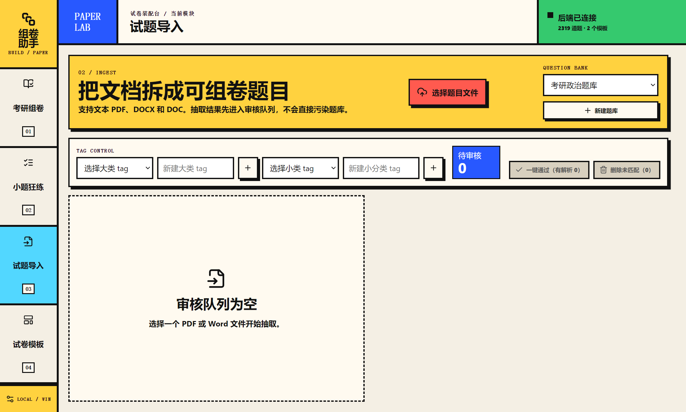
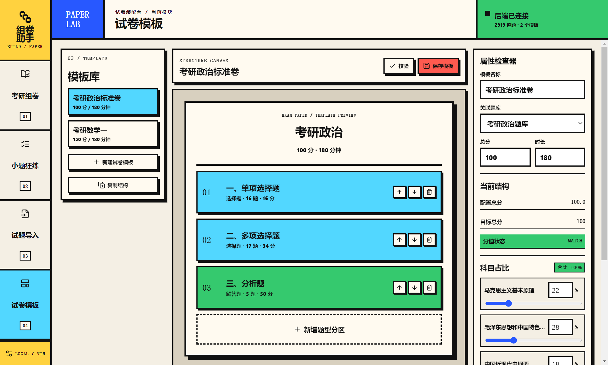

# 组卷助手

`Test-Paper-Interview-Helper` 是一个本地运行的考研题库管理、智能组卷和刷题工作台。它采用前后端分离架构，使用 Electron + React + TypeScript 提供桌面端界面，使用 FastAPI + SQLite 处理题库、组卷、审核和导出。

产品界面采用结构暴露的新粗野主义风格：硬边框、实体阴影、平面色块和明确的工作台分区。打开应用后直接进入可操作的题库工作流，不设置营销型首页。

## 功能展示

### 考研组卷

根据关联的试卷模板、题型分区、复式 tag 和固定随机种子自动选题。支持设置必须包含的大类 tag、小类 tag，并在生成后查看题目数量、题型结构和校验状态。



### 小题狂练

针对选择题进行随机练习，支持：

- 考研数学一和考研政治题库独立切换
- 学科、大类 tag、小类 tag 三级筛选
- 单项选择题和多项选择题自动判题
- “一直刷题！”连续随机出题
- “停止刷题”停止连续模式并保留当前错题
- 持久化错题本
- 错题删除
- 导出本次错题与答案 PDF



### 试题导入与审核

支持从 PDF、DOCX 和 DOC 中抽取题目，题目先进入审核队列，不会直接写入正式题库。审核页面提供原版题面预览、解析匹配状态、题型和章节修订，以及批量通过、批量删除和分片加载。



### 试卷模板

模板与题库关联保存。支持配置试卷名称、总分、时长、题型分区、题目数量、分值和大类占比。项目内置考研数学一模板，并支持政治题库使用独立的政治模板。



## 当前题库

项目运行时会根据本地 SQLite 数据库加载题库。目前支持的题库类型包括：

- 考研数学一
  - 高等数学
  - 线性代数
  - 概率论与数理统计
- 考研政治
  - 马克思主义基本原理
  - 毛泽东思想和中国特色社会主义理论体系
  - 中国近现代史纲要
  - 思想道德与法治
  - 形势与政策以及当代世界经济与政治

数学和政治题库使用独立的 `question_bank_id` 隔离。试题导入、tag 控制、模板关联、组卷和小题狂练都会基于当前题库配置，不会把政治题混入数学卷。

## 技术架构

```text
Electron
  └─ React + TypeScript + Vite
       └─ HTTP API
            └─ FastAPI + Python
                 └─ SQLite
```

主要模块：

```text
backend/
  app/
    main.py          API 路由、审核、导入、模板、导出
    db.py            SQLite 初始化、迁移和数据访问
    composer.py      模板约束和自动组卷
    practice.py      小题狂练目录、答案识别和题目清洗
    politics.py      考研政治分类规则
  data/              运行时数据库、题目、源文件和导出文件

frontend/
  electron/          Electron 主进程和 preload
  src/
    App.tsx
    components/
      ComposeView.tsx
      PracticeView.tsx
      ImportView.tsx
      TemplateView.tsx
    api.ts
    types.ts
    styles.css

scripts/
  start-backend.ps1
  capture-screenshots.cjs
  import_*.py

docs/
  design.md
  math-one-sources.md
  screenshots/
```

## 快速启动

### Windows 一键启动

双击项目根目录的 `start.bat`。脚本会：

1. 检查 Python、Node.js 和本地依赖
2. 创建或复用 `.venv`
3. 安装后端依赖
4. 启动 FastAPI
5. 启动 Electron 前端

运行要求：

- Python 3.11 或更高版本
- Node.js 20 或更高版本
- LibreOffice，用于部分 Word 文档转换和导出流程

### 手动启动

启动后端：

```powershell
.\scripts\start-backend.ps1
```

启动前端：

```powershell
cd frontend
npm install
npm run dev
```

前端开发地址默认为：

```text
http://127.0.0.1:5173
```

后端 API 默认为：

```text
http://127.0.0.1:8000/api
```

## 重新生成运行截图

README 中的图片由真实运行的 Electron 渲染窗口生成。确保后端和前端已经启动后，在项目根目录执行：

```powershell
.\frontend\node_modules\electron\dist\electron.exe .\scripts\capture-screenshots.cjs
```

截图会自动写入：

```text
docs/screenshots/
```

脚本会依次打开并截取：

1. 考研组卷
2. 小题狂练
3. 试题导入
4. 试卷模板

也可以通过环境变量指定其他前端地址：

```powershell
$env:PAPER_HELPER_URL = "http://127.0.0.1:5173"
.\frontend\node_modules\electron\dist\electron.exe .\scripts\capture-screenshots.cjs
```

## 导入题库

题目导入流程如下：

1. 在“试题导入”中选择目标题库
2. 选择 PDF、DOCX 或 DOC 文件
3. 等待题目进入审核队列
4. 检查原版题面、解析匹配状态、题型和 tag
5. 单题保存、审核入库，或批量通过有解析题目
6. 删除没有匹配解析的题目

题目使用复式 tag：

```text
[
  "大类 tag",
  "小类 tag"
]
```

例如：

```json
["高等数学", "函数、极限与连续"]
```

导入脚本位于 `scripts/`，可用于处理已经准备好的本地题册和解析册。原始 PDF、Word 文件和运行时数据库不包含在 Git 仓库中。

## 导出内容

组卷完成后支持导出：

- 题卷版 PDF
- 答案版 PDF
- 题卷版 DOCX
- 答案版 DOCX

导出的题卷版只显示原版题面，答案、解析和评分信息放在答案版中。小题狂练支持单独导出本次刷题产生的错题与答案 PDF。

## 数据位置

运行时数据默认保存在 `backend/data/`：

```text
backend/data/
  paper_helper.sqlite3  SQLite 数据库
  documents/            导入的源文件
  questions/            JSON 题目交换文件
  exports/              PDF、DOCX 导出文件
```

`backend/data/` 已加入 `.gitignore`，不会把本地题库、个人文件和导出结果提交到仓库。

## 校验命令

前端类型检查：

```powershell
cd frontend
npm run typecheck
```

前端生产构建：

```powershell
cd frontend
npm run build
```

后端语法检查：

```powershell
python -m compileall -q backend\app scripts
```

## 设计文档

- [项目设计文档](docs/design.md)
- [考研数学一题源说明](docs/math-one-sources.md)

## 版权与本地资料

本仓库只保存应用程序代码、导入脚本、模板和界面截图，不分发习题册、真题 PDF、解析 PDF 或其他受版权保护的原始资料。请仅导入自己拥有合法使用权的本地文件。

当前仓库未单独声明开源许可证。
